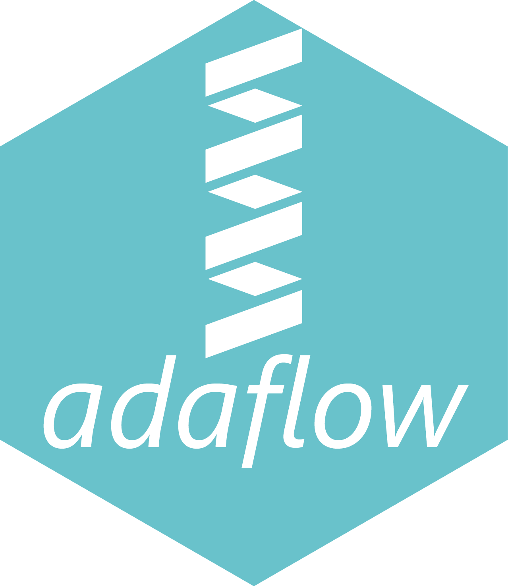

---
output:
  html_document: default
  pdf_document: default
  word_document: default
---

### **Welcome to AdaFlow**
---

<h4 align="justify" style="font-weight: normal; line-height:40px;")>
Proteomics is the large-scale study of proteins.[1][2] Proteins are vital parts of living organisms, with many functions. The word proteome is a portmanteau of protein and genome, and was coined by Marc Wilkins in 1994 while he was a Ph.D. student at Macquarie University.[3] Macquarie University also founded the first dedicated proteomics laboratory in 1995.[4][5]

The proteome is the entire set of proteins that is produced or modified by an organism or system. Proteomics has enabled the identification of ever increasing numbers of protein. This varies with time and distinct requirements, or stresses, that a cell or organism undergoes.[6] Proteomics is an interdisciplinary domain that has benefitted greatly from the genetic information of various genome projects, including the Human Genome Project.[7] It covers the exploration of proteomes from the overall level of protein composition, structure, and activity. It is an important component of functional genomics.
</h4>

